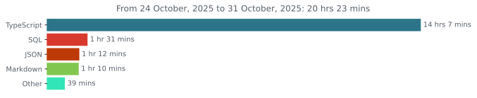

<!--START_SECTION:waka-->


**🐱 My GitHub Data** 

> 📦 744.7 kB Used in GitHub's Storage 
 > 
> 🏆 1,082 Contributions in the Year 2023
 > 
> 🚫 Not Opted to Hire
 > 
> 📜 33 Public Repositories 
 > 
> 🔑 1 Private Repositories 
 > 
**I'm an Early 🐤** 

```text
🌞 Morning                3405 commits        ████░░░░░░░░░░░░░░░░░░░░░   17.44 % 
🌆 Daytime                10333 commits       █████████████░░░░░░░░░░░░   52.94 % 
🌃 Evening                5364 commits        ███████░░░░░░░░░░░░░░░░░░   27.48 % 
🌙 Night                  418 commits         █░░░░░░░░░░░░░░░░░░░░░░░░   02.14 % 
```
📅 **I'm Most Productive on Wednesday** 

```text
Monday                   3271 commits        ████░░░░░░░░░░░░░░░░░░░░░   16.76 % 
Tuesday                  3902 commits        █████░░░░░░░░░░░░░░░░░░░░   19.99 % 
Wednesday                4148 commits        █████░░░░░░░░░░░░░░░░░░░░   21.25 % 
Thursday                 4093 commits        █████░░░░░░░░░░░░░░░░░░░░   20.97 % 
Friday                   3778 commits        █████░░░░░░░░░░░░░░░░░░░░   19.35 % 
Saturday                 150 commits         ░░░░░░░░░░░░░░░░░░░░░░░░░   00.77 % 
Sunday                   178 commits         ░░░░░░░░░░░░░░░░░░░░░░░░░   00.91 % 
```


📊 **This Week I Spent My Time On** 

```text
🕑︎ Time Zone: Asia/Tokyo

💬 Programming Languages: 
TypeScript               21 hrs 48 mins      █████████████████████░░░░   85.01 % 
JSON                     2 hrs 14 mins       ██░░░░░░░░░░░░░░░░░░░░░░░   08.76 % 
TSConfig                 16 mins             ░░░░░░░░░░░░░░░░░░░░░░░░░   01.09 % 
YAML                     14 mins             ░░░░░░░░░░░░░░░░░░░░░░░░░   00.94 % 
JavaScript               14 mins             ░░░░░░░░░░░░░░░░░░░░░░░░░   00.93 % 

🔥 Editors: 
VS Code                  25 hrs 38 mins      █████████████████████████   100.00 % 

🐱‍💻 Projects: 
drawer-pilot             24 hrs 46 mins      ████████████████████████░   96.58 % 
drawer                   18 mins             ░░░░░░░░░░░░░░░░░░░░░░░░░   01.23 % 
priveui                  17 mins             ░░░░░░░░░░░░░░░░░░░░░░░░░   01.16 % 
caddi-ui                 7 mins              ░░░░░░░░░░░░░░░░░░░░░░░░░   00.49 % 
klein-2022               5 mins              ░░░░░░░░░░░░░░░░░░░░░░░░░   00.36 % 

💻 Operating System: 
Mac                      25 hrs 38 mins      █████████████████████████   100.00 % 
```

**I Mostly Code in JavaScript** 

```text
JavaScript               23 repos            █████████░░░░░░░░░░░░░░░░   35.38 % 
TypeScript               13 repos            █████░░░░░░░░░░░░░░░░░░░░   20.00 % 
HTML                     5 repos             ██░░░░░░░░░░░░░░░░░░░░░░░   07.69 % 
CSS                      1 repo              ░░░░░░░░░░░░░░░░░░░░░░░░░   01.54 % 
Dart                     1 repo              ░░░░░░░░░░░░░░░░░░░░░░░░░   01.54 % 
```


**Timeline**


 Last Updated on 10/11/2023 18:45:06 UTC
<!--END_SECTION:waka-->



[YoungDi's github page](https://youngdi.github.io)


